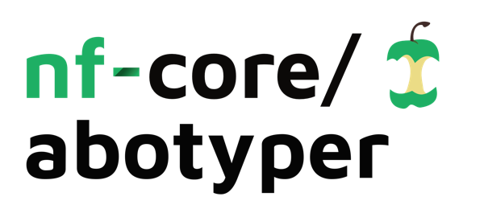
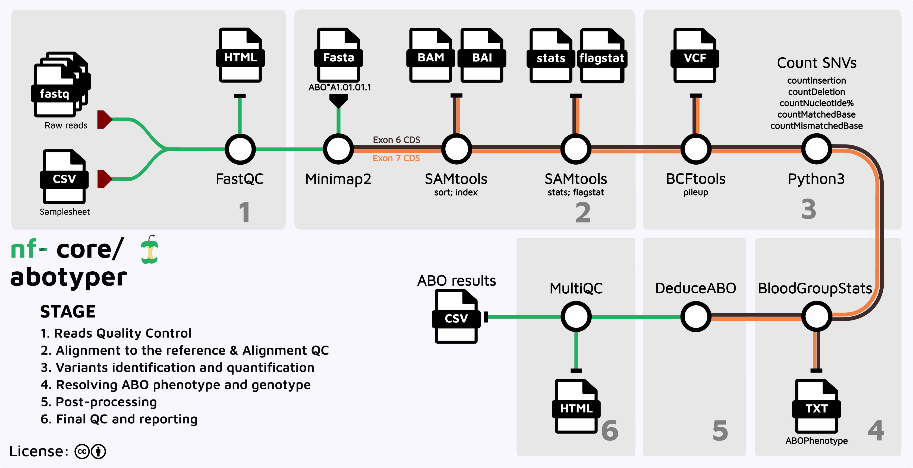

<h1>
  <picture>
    <source media="(prefers-color-scheme: light)" srcset="docs/images/nf-core-abotyper_logo_dark.png">
    
  </picture>
</h1>

<!-- [](https://github.com/nf-core/abotyper/actions/workflows/ci.yml)
[](https://github.com/nf-core/abotyper/actions/workflows/linting.yml) -->
[](https://nf-co.re/abotyper/results)
[](https://www.nf-test.com)
<!-- [](https://doi.org/XXXXXX) -->
[](https://www.nf-test.com)

[](https://www.nextflow.io/)
[](https://docs.conda.io/en/latest/)
[](https://www.docker.com/)
[](https://sylabs.io/docs/)
[](https://cloud.seqera.io/launch?pipeline=https://github.com/nf-core/abotyper)

[](https://nfcore.slack.com/channels/abotyper)
[](https://twitter.com/nf_core)
[](https://mstdn.science/@nf_core)
[](https://www.youtube.com/c/nf-core)

# ABO blood typing using Oxford Nanopore MinION sequencing

nf-core/abotyper is a bioinformatics pipeline that analyses data obtained from Third Generation Sequencing of the ABO gene to deduce the ABO blood type of the sample. It takes a samplesheet and FASTQ files as input, performs quality control (QC), mapping to the reference sequences, variant characterisation, and finally deduce the Blood Group Statistics based on known ABO-related Single nucleotide variants.



ABO sequences were acquired from the NCBI RefSeq and dbRBC databases:

- [ABO Exon 6](https://www.ncbi.nlm.nih.gov/nuccore/NG_006669.2?from=22673&to=22807&report=fasta)
- [ABO Exon 7](https://www.ncbi.nlm.nih.gov/nuccore/NG_006669.2?from=23860&to=29951&report=fasta)
- [dbMHC and IHWG data](https://ftp.ncbi.nlm.nih.gov/pub/mhc/mhc/Final%20Archive/)

Exon 7 CDS reference sequence was truncated at 817 bp as this captures the targeted SNVs within the exon and UTR's

Additional reading material on ABO [here](https://ftp.ncbi.nlm.nih.gov/pub/mhc/rbc/Final%20Archive/Excel_and_PowerPoint/).


SNVs relevant to ABO blood group genotyping are documented [here](https://bloodgroupdatabase.org/groups/details/?group_name=ABO)

# Core dependencies

The pipeline makes use of the following core dependencies:

```yaml
- bioconda::bwa=0.7.17
- bioconda::fastqc=0.12.1
- bioconda::minimap2=2.28-r1209
- bioconda::multiqc>=1.25.1
- bioconda::samtools=1.2.1
- conda-forge::biopython>=1.83
- python>=3.8
- pip
- pip:
    - pandas>=2.2.0
    - Bio>=1.6.0
    - ncurses
    - openpyxl>=3.1.0
    - XlsxWriter>=3.2.0
```

# Required input files structure

Ensure that all input fastq files have a naming convention that matches this regular expression (`regex`)

```python
## python regex for matching samples
pattern = r"^(IMM|INGS|NGS|[A-Z0-9]+)(-[0-9]+-[0-9]+)?_barcode\d+$"
```

The regex does the following:

- `^(IMM|INGS|NGS|[A-Z0-9]+)` allows for files strating with the prefixes IMM, INGS, NGS, or any combination of letters `A-to-Z` and digits `0-to-9`.
- `(-[0-9]+-[0-9]+)?` handles optional segments of digits separated by a dash(-).
- `_barcode\d+$` ensures the filename ends with_barcode followed by digits to denote barcode numbers.

There is a file handling logic in the code `filename.split("_")` that assumes the barcode is always the last part of the filename.
The names are split into `basename` and `barcode` which are then used in later reporting.<br/>Please Adjust this if necessary based on actual filename structure in your assays.

Here are a few examples of acceptable input file names:

```txt
NGSPOS_barcode13.fastq
NGSNEG_barcode12.fastq
INGSPOS_barcode01.fastq
INGSNEG_barcode96.fastq
BTGSPOS_barcode19.fastq
2025705_barcode14.fastq
IMM-45-44874_barcode25.fastq
Sample1-2024-12345_barcode22.fastq
```

# Running `nf-core/abotyper`

This pipeline has been extensively tested using conda profile. Other containerisation methods are being improved,tested and documented.

To run this pipeline, use:

```bash
nextflow run nf-core/abotyper \
  -resume \
  -profile conda \
  --input samplesheet.csv \
  --outdir "$PWD/OUTDIR"
```

Once improved, other workload managers and containerisation environments could be used in a similar manner:

```bash
nextflow nf-core/abotyper \
  -resume \
  -profile <docker/singularity/.../institute> \
  --input samplesheet.csv \
  --outdir <OUTDIR>
```


<!-- TODO 
# Renaming samples

The code by default renames samples using a tab file with `sequencingID` and `sampleName` (see `nextflow.config` file under `$params.renaming_file`).
This option is controlled by the parameter `$params.skip_renaming` and can be overridden via the commandline using option `--skip_renaming true` to skip the process.
-->


# Output
For each sample and each of exon6 and exon7, the pipeline will generate `BAM` files, `BAM metrics`, and `PILEUP` results.

The output directory generated by this `Nextflow` pipeline will look something like this:

```
OUTDIR/
├── ABO_results.log
├── ABO_result.txt
├── ABO_result.xlsx
├── final_export.csv
├── per_sample_processing
│   ├── SAMPLE1_barcode01
│   │   ├── exon6
│   │   │   ├── ABOReadPolymorphisms.txt
│   │   │   ├── alignment
│   │   │   │   ├── SAMPLE1_barcode01.bam
│   │   │   │   ├── SAMPLE1_barcode01.bam.bai
│   │   │   │   ├── SAMPLE1_barcode01.coverage.txt
│   │   │   │   ├── SAMPLE1_barcode01.flagstat
│   │   │   │   └── SAMPLE1_barcode01.stats
│   │   │   ├── SAMPLE1_barcode01.ABOPhenotype.txt
│   │   │   ├── SAMPLE1_barcode01.AlignmentStatistics.tsv
│   │   │   ├── SAMPLE1_barcode01.log.txt
│   │   │   └── mpileup
│   │   │       └── SAMPLE1_barcode01.mpileup.gz
│   │   └── exon7
│   │       ├── ABOReadPolymorphisms.txt
│   │       ├── alignment
│   │       │   ├── SAMPLE1_barcode01.bam
│   │       │   ├── SAMPLE1_barcode01.bam.bai
│   │       │   ├── SAMPLE1_barcode01.coverage.txt
│   │       │   ├── SAMPLE1_barcode01.flagstat
│   │       │   └── SAMPLE1_barcode01.stats
│   │       ├── SAMPLE1_barcode01.ABOPhenotype.txt
│   │       ├── SAMPLE1_barcode01.AlignmentStatistics.tsv
│   │       ├── SAMPLE1_barcode01.log.txt
│   │       └── mpileup
│   │           └── SAMPLE1_barcode01.mpileup.gz
├── pipeline_info
│   ├── execution_report_DATETIME.html
│   ├── execution_timeline_DATETIME.html
│   ├── execution_trace_DATETIME.txt
│   ├── nf_core_pipeline_software_mqc_versions.yml
│   ├── params_DATETIME.json
│   └── pipeline_dag_DATETIME.html
└── qc-reports
    ├── fastqc
    │   ├── SAMPLE1_barcode01_fastqc.html
    │   ├── SAMPLE1_barcode01_fastqc.zip
    └multiqc
        ├── multiqc_data
        ├── multiqc_plots
        │   ├── pdf
        │   ├── png
        │   └── svg
        └── multiqc_report.html
```

The `ABO_result.xlsx` Excel worksheet contains details of all SNVs and metrics used to deduce the ABO phenotype for each sample.

A summary of the ABO typing results is provided in `final_export.csv`

Feel free to raise an issue or reach out if you need any support getting this tool running, or with suggestions for improvement.

# Credits

nf-core/abotyper was originally written by Fredrick M. Mobegi: [@fmobegi](https://github.com/fmobegi) at the Department of Clinical Immunology, [PathWest Laboratory Medicine WA](https://pathwest.health.wa.gov.au/).

We thank the following people for their extensive assistance in the development of this pipeline:

  - [Benedict Matern](https://github.com/bmatern)
  - [Mathijs Groeneweg](https://orcid.org/0000-0002-6615-9239)

Maintenance and future developements will be led by Fredrick Mobegi.

# Acknowledgements

<p float="center">
  
  
</p>

# Contributions and Support

If you would like to contribute to this pipeline, please see the [contributing guidelines](.github/CONTRIBUTING.md).

For further information or help, don't hesitate to get in touch on the [Slack `#abotyper` channel](https://nfcore.slack.com/channels/abotyper) (you can join with [this invite](https://nf-co.re/join/slack)).

# Citations

<!-- TODO nf-core: Add citation for pipeline after first release. Uncomment lines below and update Zenodo doi and badge at the top of this file. -->
<!-- If you use nf-core/abotyper for your analysis, please cite it using the following doi: [10.5281/zenodo.XXXXXX](https://doi.org/10.5281/zenodo.XXXXXX) -->

<!-- TODO nf-core: Add bibliography of tools and data used in your pipeline -->

An extensive list of references for the tools used by the pipeline can be found in the [`CITATIONS.md`](CITATIONS.md) file.

You can cite the `nf-core` publication as follows:

> **The nf-core framework for community-curated bioinformatics pipelines.**
>
> Philip Ewels, Alexander Peltzer, Sven Fillinger, Harshil Patel, Johannes Alneberg, Andreas Wilm, Maxime Ulysse Garcia, Paolo Di Tommaso & Sven Nahnsen.
>
> _Nat Biotechnol._ 2020 Feb 13. doi: [10.1038/s41587-020-0439-x](https://dx.doi.org/10.1038/s41587-020-0439-x).
